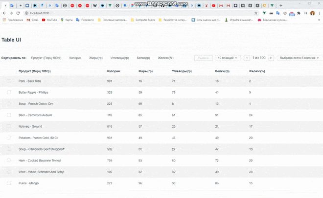

## Тестовое задание для IdaProject

C нуля написанная таблица. Таблица имеет сортировку, отображение по столбцам, возможность выбора кол-ва показываемых записей, возможность выбора позиций для массового удаления. Запросы написаны таким образом, чтобы иногда выдавать ошибку для того чтобы написать их обработку.

## Project setup
```
npm install
```

### Compiles and hot-reloads for development
```
npm run serve
```

### Compiles and minifies for production
```
npm run build
```

### Run your unit tests
```
npm run test:unit
```

### Lints and fixes files
```
npm run lint
```

### Customize configuration
See [Configuration Reference](https://cli.vuejs.org/config/).
